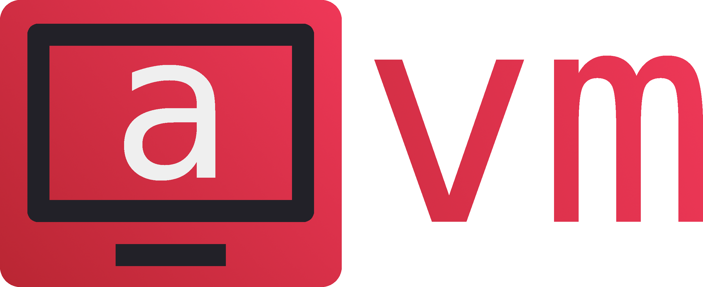

<p align="center">
	
</p>
<p align="center">A stack based virtual machine</p>

<p align="center">
	<a href="./LICENSE">
		
	</a>
	<a href="https://github.com/avm-collection/avm/issues">
		
	</a>
	<a href="https://github.com/avm-collection/avm/pulls">
		
	</a>
</p>

A simple unfinished stack based virtual machine written in C.

## Table of contents
* [Write a program](#write-a-program)
* [Quickstart](#quickstart)
* [Milestones](#milestones)
* [Documentation](#documentation)
* [Bugs](#bugs)
* [Make](#make)

## Write a program
You probably do not want to write programs in binary, so you can find the assembler with examples [here](https://github.com/avm-collection/anasm).

## Quickstart
```sh
$ make
$ make install
$ avm PROGRAM
```

## Milestones
- [X] Basic stack operators
- [X] Executing from files
- [X] Conditional instructions, jumps
- [X] RAM
- [ ] File reading, IO
- [ ] Loading shared libraries

## Documentation
Coming soon.

## Bugs
If you find any bugs, please create an issue and report them.

## Make
Run `make all` to see all the make rules.
